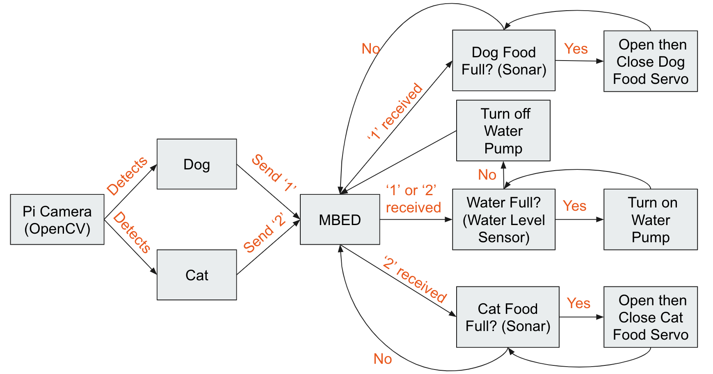

# Pet Detection Feeder
#### Georgia Institute Of Technology
#### ECE 4180 Fall 2018
#### Contributors: Yassine Bennani, Andrew Taira, Landan Seguin, Weerapitch Panlertkitsakul

## Project Summary

Autonomous pet feeder that uses ARM Mbed and Raspberry Pi 3. This feeder dispenses 2 different types of pet food for 2 different species of pets and water into a water bowl. Using a Raspberry Pi Camera, the Raspberry Pi runs image recognition using OpenCV to detect when a pet is in front of the feeder. After determining the pet, the Pi sends a signal to the Mbed to dispense the corresponding food and water into the bowls. The Mbed uses sonar and water level sensors to stop dispensing when the bowls are full.

## Pictures

## Pin Diagram

## Block Diagram (Program Flow)



## Hardware Components
* [Arm Mbed LPC1768](https://os.mbed.com/platforms/mbed-LPC1768/)
* [Raspberry Pi 3 Model B+](https://www.raspberrypi.org/products/raspberry-pi-3-model-b-plus/)
* [Raspberry Pi 3 Camera](https://www.raspberrypi.org/products/camera-module-v2/)
* [Sonar Sensor (2x)]()
* Water Pump
* Servo Motor (2x)
* Water Sensor


## Computer Vision Setup

For the pet detection algorithm, we prioritized speed (frames per second (FPS)) over accuracy so the [YOLO architecture](https://pjreddie.com/darknet/yolo/) was used. Specifically, we used fastest but least accurate variation on the YOLO architecture, **the YOLOv3-tiny model**. FPS was increased using a technique called quanitzation which converts the neural network weights from float32 type to int8. Most of the code is from [this repository](https://github.com/AlexeyAB/yolo2_light), but there were minor changes. 

The pet detection algorithm was run on a Raspberry Pi 3 Model B+ with a Raspberry Pi Camera. OpenCV was used to capture images from the camera and feed them through the neural network. [This tutorial](http://pklab.net/?id=392&lang=EN) was used to install OpenCV and to test the interface with the camera.

After following the instructions in the yolo2_light library, Run this command from yolov2_light/bin to start the pet detection algorithm on the Raspberry Pi:

``` shell
./darknet detector demo coco.names yolov3-tiny.cfg yolov3-tiny.weights -s 10 -thresh 0.1 -quantized
```

Final FPS: 0.05
Final mAP: 33.1 

## MBED Code

```cpp
#include "mbed.h"
#include "Servo.h"
Servo catServo(p21);
Servo dogServo(p22);
DigitalOut myled(LED1);
DigitalOut myled2(LED2);
PwmOut Ctrl(p25);
RawSerial  pi(USBTX, USBRX);
AnalogIn water(p20);

// dog sonar initializations
DigitalOut dogTrigger(p10);
DigitalIn  dogEcho(p12);
int dogSonarDistance = 0;
int dogSonarCorrection = 0;
Timer dogSonarTimer;

// cat sonar initializations
DigitalOut catTrigger(p6);
DigitalIn  catEcho(p8);
int catSonarDistance = 0;
int catSonarCorrection = 0;
Timer catSonarTimer;

int dist1=0;
int dist2=0;
int dist3=0;

int dist4=0;
int dist5=0;
int dist6=0;
float wat;
bool cond;
bool dogSensed = false;
bool catSensed = false;
bool waterSensed = false;

void fillDogFood() {
    printf("dooooooooooog!!!!!!");
    // dogTrigger dogSonarTimer to send a ping
    dogTrigger = 1;
    myled = 1;
    myled2 = 0;
    dogSonarTimer.reset();
    wait_us(10.0);
    dogTrigger = 0;
    myled = 0;
    //wait for dogEcho high
    while (dogEcho==0) {};
    myled2=dogEcho;
    //dogEcho high, so start timer
    dogSonarTimer.start();
    //wait for dogEcho low
    while (dogEcho==1) {};
    //stop timer and read value
    dogSonarTimer.stop();
    //subtract software overhead timer delay and scale to cm
    dogSonarDistance = (dogSonarTimer.read_us()-dogSonarCorrection)/58.0;
    myled2 = 0;
    dist1=dist2;
    dist2=dist3;
    dist3 = dogSonarDistance;
    printf(" %d dog cm \n\r",dogSonarDistance);
    if(dist1 >= 50 && dist2>=50 && dist3 >=50){
        dogSensed = false;
        printf("-------------------------------------------------");
        break;
    }
    if(dogSonarDistance>=0 && dogSonarDistance <=40){
        if(dogSonarDistance <= 40 && dogSonarDistance >= 23){
            dogServo = 0.3;
            wait(0.3);
            dogServo = 1.0;
            wait(0.7);
        }
    }
    //wait so that any dogEcho(s) return before sending another ping
    wait(0.2);
}

void fillCatFood() {
    printf("caaaaaaaaaaaaat!!!!!!");
    // trigger sonar to send a ping
    catTrigger = 1;
    catSonarTimer.reset();
    wait_us(10.0);
    catTrigger = 0;
    //wait for echo high
    while (catEcho==0) {};
    //echo high, so start timer
    catSonarTimer.start();
    //wait for echo low
    while (catEcho==1) {};
    //stop timer and read value
    catSonarTimer.stop();
    //subtract software overhead timer delay and scale to cm
    catSonarDistance = (catSonarTimer.read_us()-correction)/58.0;
    dist4=dist5;
    dist5=dist6;
    dist6 = catSonarDistance;
    printf(" %d cat cm \n\r",catSonarDistance);
    if((dist4 >= 41 && dist5>=41 && dist6 >=41) || (dist4 <= 22 && dist5 <=22 && dist6 <=22)){
        printf("-------------------------------------------------");
        catSensed = false;
        break;
    }
    if(catSonarDistance>=0 && catSonarDistance <=40){
        if(catSonarDistance <= 35 && catSonarDistance >= 23){
            catServo = 0.5;
            wait(0.3);
            catServo = 0.0;
            wait(0.7);
        }
    }
    //wait so that any echo(s) return before sending another ping
    wait(0.2);
}

void fillWater() {
    wat = (float) water;
    if(wat >= 0.45){
        Ctrl = 0;
        waterSensed = false;
    } else if(wat<0.20){
        Ctrl = 7;
    } else{
        Ctrl = 0;
        waterSensed = false;
    }
    wait(0.3);
}

void dev_recv()
{
   char temp = 0;
   myled = !myled;
   while(pi.readable()) {
       temp = pi.getc();
       if (temp=='2') {
           myled2 = 1;
           catSensed = true;
       }
       if (temp=='1') {
           myled2 = 1;
           dogSensed = true;
       }
   }
}

int main(){
    catServo = 0.0;
    dogServo = 1.0;
    pi.baud(9600);
    pi.attach(&dev_recv, Serial::RxIrq);
    wait(2);

    while(1){
        dogSensed = false;
        catSensed = false;
        // check for signals from Pi
        while(!dogSensed && !catSensed) {
            sleep();
        }

        // dog
        if (dogSensed) {
            // get sonar correction
            waterSensed = true;
            dogSonarTimer.reset();
            dogSonarTimer.start();
            while (dogEcho==2) {};
            dogSonarTimer.stop();
            dogSonarCorrection = dogSonarTimer.read_us();
            while (dogSensed || waterSensed) {
                if (dogSensed) {
                    fillDogFood();
                }

                if (waterSensed) {
                    fillWater();
                }
            }
        }

        // cat food
        if (catSensed) {
            // get sonar correction
            waterSensed = true;
            catSonarTimer.reset();
            catSonarTimer.start();
            while (catEcho==2) {};
            catSonarTimer.stop();
            catSonarCorrection = catSonarTimer.read_us();
            while (catSensed || waterSensed) {
                if (catSensed) {
                    fillCatFood();
                }

                if (waterSensed) {
                    fillWater();
                }
            }
        }

        wait(10);
        myled2 = 0;
    }
}
```

## Video
https://youtu.be/Cu3q304zTRU
